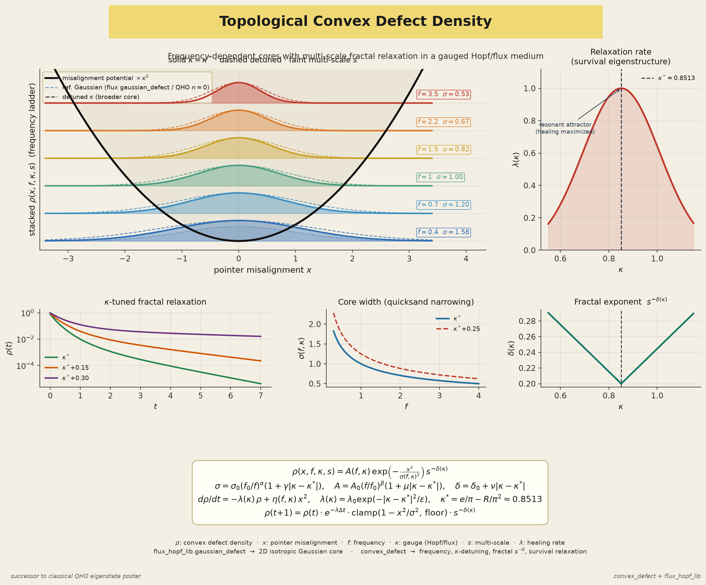

# convex_defect

Frequency-dependent topological **convex defect density** with \(\kappa\)-tuned fractal relaxation.

Extends the `mystery` / `flux_trajectoid` research line: pointer misalignment produces Gaussian + multi-scale fractal defects that increase topological opacity, accumulate holonomy along geodesics, and heal under survival-eigenstructure rates.

## Install

```bash
cd ~/Projects/convex_defect
pip install -e ".[dev]"
# optional Gradio UI:
# pip install -e ".[demo]"
```

## Quick start

```python
from convex_defect import DefectModel, run_simulation

model = DefectModel()  # defaults: κ* ≈ 0.8513
rho = model.rho(x=0.1, f=1.0, kappa=0.85, s=1.0)
tau = model.opacity(x=0.1, f=1.0, kappa=0.85)

result = run_simulation(n_steps=100, f=1.0, x0=0.4, seed=0)
print(result.H[-1], result.rho[-1])

# multi-scale dynamical ρ(s)
ms = run_simulation(n_steps=80, multi_scale=True, n_scales=16, grid_shape=(32, 32), x0=0.5)
print(ms.rho_spectrum_final.shape, ms.screen_final.shape)
```

```bash
# plots → outputs/
python examples/convex_defect_demo.py

# CLI
convex-defect run --steps 100 --freq 1.5
convex-defect sweep-f --fmin 0.5 --fmax 3 --n 10
convex-defect sweep-k --kmin 0.6 --kmax 1.1
convex-defect demo
convex-defect gradio   # needs pip install -e '.[demo]'

pytest
```

## Layout

| Path | Role |
|------|------|
| `docs/convex_defect_theory.md` | Equations + mapping to oam_flux / mystery / trajectoids |
| `src/convex_defect/defect_density.py` | \(\rho(x,f,\kappa,s)\), \(\sigma\), \(A\), \(\tau\) |
| `src/convex_defect/multi_scale_field.py` | Dynamical multi-scale \(\rho(s)\) / spatial \(\rho(x_{ij},s)\) |
| `src/convex_defect/holonomy_accumulator.py` | Fractal holonomy \(H(t)\) (pure accumulation, double fractal) |
| `src/convex_defect/relaxation_dynamics.py` | Survival-eigenstructure relaxation + clamp |
| `src/convex_defect/simulator.py` | Coupled pointer + \(\rho\) + \(H\); optional 1D/2D grid |
| `src/convex_defect/cli.py` | Thin CLI |
| `src/convex_defect/gradio_app.py` | Optional interactive UI |
| `examples/convex_defect_demo.py` | Plots: Gaussian vs \(f\), relaxation, \(H(t)\), phase screens |
| `examples/plot_qho_successor_diagram.py` | QHO-successor poster (frequency ladder + \(\kappa\) relaxation) |
| `docs/topological_convex_defect_qho_successor.png` | Rendered theory poster |
| `tests/test_convex_defect.py` | Unit tests |

## Conceptual links

- **Holonomy gaps** / \(\kappa^*\) — `mystery` residual \(\kappa\) sweeps
- **Survival eigenstructure** — `pde_survival_eigenstructure` relaxation rates
- **OAM flux / turbulence** — `oam_flux` + `flux_trajectoid` propagation screens (`grid_to_phase_screen`)
- **Trajectoid geodesics** — rolling paths on a fractally textured manifold
- **Flux / Hopf primitives** — `flux_hopf_lib` (`gaussian_defect`, gauge \(\kappa\), survival)

See `docs/convex_defect_theory.md` for the full equation set.

## From QHO to topological defect density

The classical 1D quantum harmonic oscillator (QHO) poster — parabolic well, Hermite eigenstates \(n=0,1,2,\ldots\), densities \(|\psi_n(x)|^2\) — is **not** what this package implements. The only structural kinship is the **Gaussian core**: QHO ground state \(\psi_0\), `flux_hopf_lib.gaussian_defect`, and the Gaussian factor in

\[
\rho(x,f,\kappa,s)
  = A(f,\kappa)\,
    \exp\!\left(-\frac{x^2}{\sigma(f,\kappa)^2}\right)\,
    s^{-\delta(\kappa)}.
\]

Frequency \(f\), gauge detuning from \(\kappa^*\approx 0.8513\), multi-scale fractal weight \(s^{-\delta(\kappa)}\), and survival-eigenstructure healing \(\lambda(\kappa)\) are the new physics; they live here (and on top of `flux_hopf_lib` gauge/survival primitives), not in textbook QHO.



**Figure.** Frequency-dependent cores with multi-scale fractal relaxation in a gauged Hopf/flux medium. Solid: resonant \(\kappa=\kappa^*\); dashed: detuned; faint: multi-scale \(s\). Insets: \(\lambda(\kappa)\) (healing maximized at the resonant attractor), relaxation trajectories, quicksand narrowing of \(\sigma(f)\), and fractal exponent \(\delta(\kappa)\). Full caption and mapping table: [`docs/convex_defect_theory.md`](docs/convex_defect_theory.md#relation-to-the-classical-quantum-harmonic-oscillator).

```bash
# regenerate poster
PYTHONPATH=src python examples/plot_qho_successor_diagram.py
```

---

X: [@kinaar8340](https://x.com/kinaar8340)
